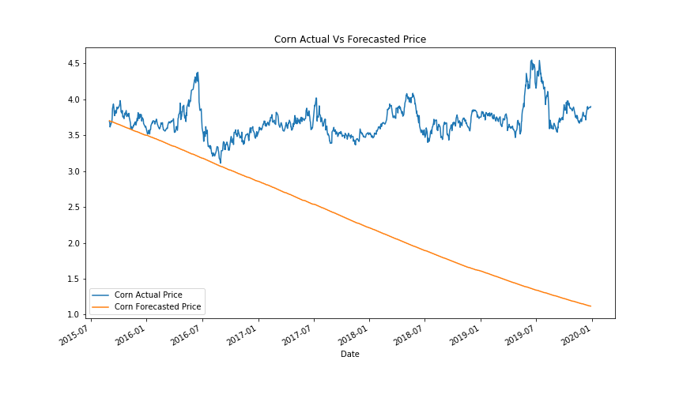

# FinTech Bootcamp University of Toronto
# Is it possible to predict corn price with weather?

## 1. Summary
The pupose of this project is to se see if we can use weather data to predict the US corn price. This was done by ...

Various datasets was extracted and analyzed,  visualizations done in Pyviz, Time series analysis performed to predict the future price of corn, which was then used in a XG Boost Machine learning model. The outcome was then used validate our research and assumptions.

xxx

## 2. Background

Maize (corn) is the dominant grain grown in the world. Total maize production in 2018 equaled 1.12 billion tons. Maize is used primarily as an animal feed in the production of eggs, dairy, pork and chicken. The US produces 32% of the world’s maize followed by China at 22% and Brazil at 9%. In addition, the US is the leading consumer of corn worldwide. In 2019/2020, the U.S. consumed about 12.3 billion bushels of corn. China, the runner up, consumed about 10.98 billion bushels of corn in that year.  

### What determines the price of corn?
In a free market economy, price is determined by the supply and demand for a product or commodity. Short-term price gyrations often occur and can be influenced by market reactions to news concerning such things as weather, government reports and/or policy. Corn is a commodity that reflects this scenario. 

  #### Supply sources:
  1. Leftover stocks from previous year
  2. Domestic production 
        Weather plays a critical role in domestic production - especially for planting and harvesting dates which impact the size of the crop. The United States Department of Agriculture (USDA) publishes several crop reports each year, which often cause wide price swings as the market interprets the numbers.
  3. International imports

  #### Demand sources: 
  1. Feed and residual
  2. Exports - US is a major supplier of corn to various countries
  3. Food and industrial use is at approximately 40% of the supply, of which the largest component is ethanol production. 

  #### Price: Supply vs Demand
  Supply and demand interact to determine price. The market does react to short-term events, but knowing the sources of supply and demand, and when estimates of these are released, will provide the opportunity to purchase corn and cattle feed at lower prices.

Corn price seasonality: 

Ideal weather conditions:

## 2. Project Approach 

|Phase | Description | Summary of Findings |
| --- | --- | --- |
| **Phase 1: Research** | 4 Commodities were reasearched to determine which would be suitable for project: Corn, Soy, Cocoa and Sugar | Limit scope to corn due to the use and production in US, limiting data extraction to only US |
| **Phase 2: Data extraction** |Datasets were extracted from Jan 2000 to Nov 2020: Corn price, Corn futures, weather max min and precipitation from 51 states, ethanol futures, USD index, USD Inflation | Reviewed the size of data and elimitate|
| **Phase 3: Data refinement and imports** | Data timeframe was from Jan 2005 to Nov 2020: Corn price, weather max min and precipitation from 5 states in corn-belt, ethanol futures, USD index, USD Inflation | Data imported into Jupyter notebooks for data cleanup and analysis
| **Phase 4: Weather data analysis** |   |   |
| **Phase 5: Time series analysis of corn price** |   |   |
| **Phase 6: Algorythmic Trading of corn price** | Constructed a comprehensive trading template fetching data to trading performance evaluation dashboard of corn  |   |
  **Phase 8: Machine learning for validation of assumptions** 
| **Phase 7: Overall Findings and conclusion** | All fidings from various phases were evaluated and compared  | Conclusion formulated  |

## 3. Weather information

## 4. Time series analysis
The ARIMA time series analysis was performed with and without seasonality. 

### ARIMA time series analysis findings without seasonality
   * Training and validation datasplit was done at 70%/30% and Hodrick-Prescott Filter was used to decompose the data into trend and noise
   * Autocorrelation and partial autocorrelation analysis was performed to determine lag to be applied in ARIMA model
   * Corn returns was forecasted using ARIMA model using order of 3,1,2. 
   * Forecasted value was then calculated from the adjusted closing price ?????
      
  
### ARIMA time series analysis findings with seasonality
   * 

## 5. Algorythmic Trading

## 6. Deep Learning: XG Boost

## 7. Major Findings

