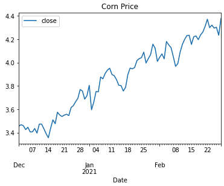
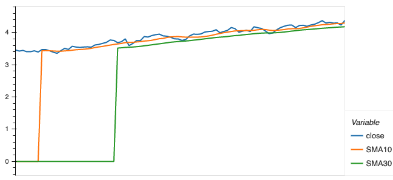
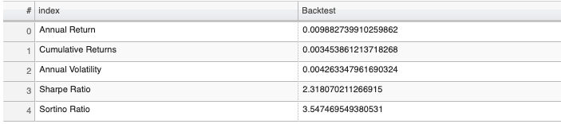
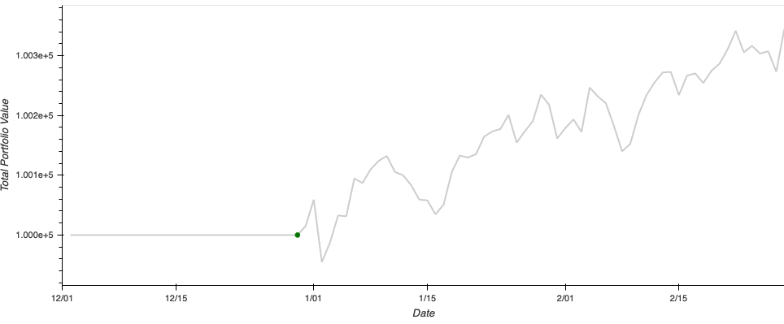

# FinTech Bootcamp University of Toronto
# Can you predict the corn price with weather features

## 1. Summary
The aim of this project was to analyze the US corn price and build models where weather data is used to determine the predictability thereof. 
Various datasets were extracted and analyzed,  visualizations done in Pyviz, Time series analysis performed to predict the future price of corn, which was then used in a XG Boost Machine learning model. The outcome was then used validate our research and assumptions.

xxx

## 2. Background

Maize (corn) is the dominant grain grown in the world. Total maize production in 2018 equaled 1.12 billion tons. Maize is used primarily as an animal feed in the production of eggs, dairy, pork and chicken. The US produces 32% of the world’s maize followed by China at 22% and Brazil at 9%. In addition, the US is the leading consumer of corn worldwide. In 2019/2020, the U.S. consumed about 12.3 billion bushels of corn. China, the runner up, consumed about 10.98 billion bushels of corn in that year.  

Corn Futures are traded at the Chicago Board of Trade (CBOT), NYSE Euronext (Euronext) and Tokyo Grain Exchange (TGE). Commodities are traded based on margin, and the margin changes based on market volatility and the current face value of the contract.

### What determines the price of corn?
In a free market economy, price is determined by the supply and demand for a product or commodity. Short-term price gyrations often occur and can be influenced by market reactions to news concerning such things as weather, government reports and/or policy. Corn is a commodity that reflects this scenario. 

  #### Supply sources:
  1. Leftover stocks from previous year
  2. Domestic production  
        Weather plays a critical role in domestic production - especially for planting and harvesting dates which impact the size of the crop. The United States Department of Agriculture (USDA) publishes several crop reports each year, which often cause wide price swings as the market interprets the numbers.
  3. International imports

  #### Demand sources: 
  1. Feed and residual
  2. Exports - US is a major supplier of corn to various countries
  3. Food and industrial use is at approximately 40% of the supply, of which the largest component is ethanol production. 

  #### Price: Supply vs Demand
  Supply and demand interact to determine price. The market does react to short-term events, but knowing the sources of supply and demand, and when estimates of these are released, will provide the opportunity to purchase corn and cattle feed at lower prices.

#### Corn price fluctuation: 
* Seasonal tendency of corn price:
   * Late June or early July - corn hits yearly peak prices
   * November - harvest time - corn hits yearly lowest price
   * November - March during winter, corn prices has least volatility.

* Ideal weather conditions:
Corn does best with warm, sunny growing weather, well-distributed intermittent moderate rains, or irriga­tion (15 or more inches during the growing season), and 130 or more frost-free days. The U.S. corn belt has these soil and climatic conditions.

   * Ideal growth temperatures: 5C - 35C
   * Survival temperatures: 0C - 43C
   * Lethal: 0C and below, -2C for a few minutes is lethal

## 2. Project Approach 

|Phase | Description | 
| --- | --- | 
| **Phase 1: Research** | 4 Commodities were reasearched to determine which would be suitable for project: Corn, Soy, Cocoa and Sugar. Refined to scope to corn due to the use and production in US, limiting data extraction to only US |
| **Phase 2: Data extraction** |Datasets were extracted from Jan 2000 to Nov 2020: Corn price, Corn futures, weather max min and precipitation, ethanol futures, USD index, USD Inflation | Reviewed the size of data and elimitate|
| **Phase 3: Scope refinement and data imports** | Data timeframe was from Jan 2000 to Nov 2019: Corn price, weather max min and precipitation from 5 states in corn-belt, ethanol futures, USD index. Data imported into Jupyter notebooks for data cleanup
| **Phase 3: Weather data analysis** | Data analysis performed and dashboard built in Pyviz 
| **Phase 4: Time series analysis of corn price** | ARIMA and SARIMA models used to predict the corn price through daily and monthly forecasting. Linear regression analysis was done daily and monthly multiple features to predict corn price | 
| **Phase 5: Algorythmic Trading of corn price** | Constructed a comprehensive trading template fetching data to trading performance evaluation dashboard of corn. Used forecasted corn prices derived from Linear regression models |
| **Phase 6: Machine learning for validation of assumptions** | Predicted corn price using weather data as feature and compared against prediction with multiple features |
  

## 3. Data
Data files can be located in the [Resources Folder](./Resources).  

The following table summarizes the data used and where it was sourced:

|Data | Source | 
| --- | --- | 
| Corn price | Daily price of corn   | www.Macrontrends.net  | 
| Ethanol futures  | Yahoo Finance API   |    
| USD Index  | Yahoo Finance API   |   
| Weather data  |  NOAA  [Weather data](./Resources/corn_belt_weather.csv) |

 

## 4. Weather information
Weather Data for the states Illinois, Indiana, Nebraska, Ohio, Iowa was pulled from the [NOAA's National Centers for Environmental Information (NCEI) Climate Data Online](https://www.ncdc.noaa.gov/cdo-web/webservices/v2) from January 1, 2000 to December 31, 2019. 

Ten weather stations from each state were chosen at random to provide daily data on max temperature (TMAX), min temperature (TMIN), and precipitation (PRCP). The weather stations inside each state were averaged to provide one dataset (TMAX, TMIN, PRCP) per day.  

## 4. Time series analysis
In order to forecast the corn price, we started with the univariate time series data i.e. with the historical corn price and applied Autoregressive Integrated Moving Average, or ARIMA method. Although the method can handle data with a trend, it does not support time series with a seasonal component. Therefore, we applied an extension to ARIMA that supports the direct modeling of the seasonal component of the series is called SARIMA. We used historical corn price data from January 2020 to October 2020 to these models.  

### General Approach followed in both ARIMA and SARIMA models are as follows:
We created monthly time series models and forecasted the movement of the corn prices as outlined below:
1. Data Imports and Cleanup
2. Decomposition using a Hodrick-Prescott filter (decomposed the Corn Price into trend, noise and seasonality(SARIMA))
3. Variable selection based on stationarity (Corn Price versus transformations such as %change, Logarithmic, First Difference, Seasonal Difference, Seasonal Adjustment) 
4. Autocorrelation & Partial Autocorrelation Analysis to find the optimal parameters
5. Training and validation datasplit at 80%/20%
6. Model Development
7. Derivation and validation the forecast for 50 months of data starting September 2016
8. Compared the actual versus forecasted values for both ARIMA and SARIMA models and looked at the MSE
9. Forecasted 6 months of Corn Price using SARIMA from November 2020 till April 2021
<i> Note that we had tried daily forecating of corn Price using ARIMA but it yielded is poor model, hence we chose to build models at the monthly level which were better in forcasting </i>  

### Findings
Time series analysis and modelling helped answer the following questions:
1. It was determined that the SARIMA model is better in predicting corn prices as the MSE (Mean Squared Error) of our one-step ahead forecasts yields a value of 0.094, which is lower compared to MSE of ARIMA (1.01) and it is closer to 0. An MSE of 0 would that the estimator is predicting observations of the parameter with perfect accuracy, which would be an ideal scenario but it not typically possible!  

 

 

2. Six month Corn Price forecast using SARIMA looks as below and is in-line with the previous trends  

 

## 5. Algorithmic Trading

The algorithmic trading was performed on forecasted U.S. corn price solely in 2020. Both the portfolio performance for backtesting and the actual trading performance were evaluated and presented in a dashboard.

* Forecased Corn Price: The corn price for 2020 Jan - 2020 Mar was predicted using linear regression

   

* Technical Indicator: Crossover between 10-day simple moving average (SMA10) and 30-day simple moving average (SMA30)

* Signals: Buy when `SMA10 < SMA30`; sell when `SMA10 > SMA30`; hold when `SMA10 = SMA30`

* Trading Performance Evaluation:  
  - Shares on Hold: `27132`
  - Account Balance: `$0.295`
  - Account Total Monetary Value: `$103968.4`
  - Account Initial Capital: `$100000`

Trading Activities Recorded  
  

*  Portfolio Performance Evaluation from backtesting:
  - Annual Return: `0.21%`
  - Cumulative Return: `0.072%`
  - Annual Volatility: `0.319%`
  - Sharpe Ratio: `0.645`
  - Sortino Ratio: `0.971`

Commodity Portfolio Performance Evaluation  
  

Forecasted Corn Price Chart with trading signals labeled  

## 6. Deep Learning: XG Boost

The XGBoost model was used to evaluate our initial understanding of factors that impact the corn prices. Specifically, the corn price prediction and the associated performance evaluation was performed with solely 
weather data and with all features, respectively.

### XGBoost Modelling with weather data alone

- Features used:  `avg_prcp`, `avg_max` and  `avg_min` 
- Data Range: `2005 - 2020`
- window of size 5 was used 
- 70-30 train-test split
- Median Average Error (MAE): `0.722`
- Average Evaluation Score: `0.703`

### XGBoost Modelling with all features

- Features used: `avg_prcp`, `avg_max`, `avg_min`, `USD_index`, `ethanol_future`, `natural_gas_future`
- Data Range: `2005 - 2020`
- window of size 5 was used 
- 70-30 train-test split
- Median Average Error (MAE): `0.133`
- Average Evaluation Score: `0.187`

## 7. Conclusion of findings
   * Weather data cannot solely be used to predict corn price
   * Based on analysis, including the macro-economic factors in models, result in better prediction of corn price
   * You have a chance to make money trading corn using our models!

